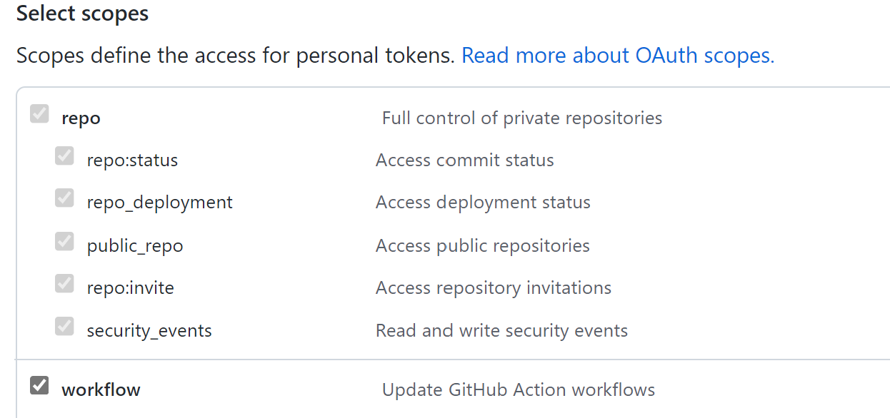
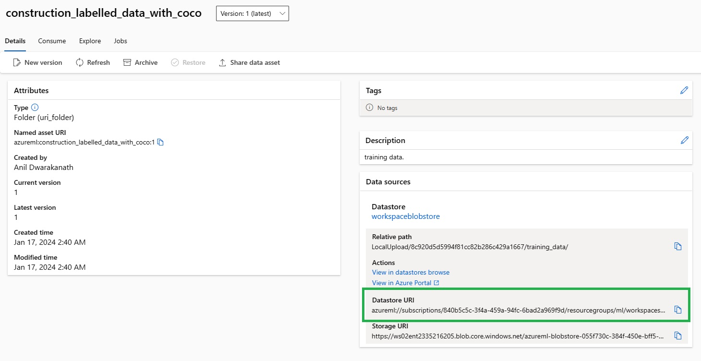

# Azure ML Setup and Configuration Guide

This guide provides step-by-step instructions for setting up and configuring your Azure Machine Learning environment using both PowerShell and Bash. Please replace placeholder values (e.g., `<subscription-id>`, `<workspace>`, `<resource-group>`, `<location>`) with your actual Azure subscription and resource details.

## Local Development Environment Setup

- Install [AZ CLI](https://learn.microsoft.com/en-us/cli/azure/install-azure-cli)
- Install [AML Python SDK V2](https://learn.microsoft.com/en-us/python/api/overview/azure/ai-ml-readme?view=azure-python)
- Install az ml CLI v2
    - Run the following command to see the `az extension`
        ```bash 
        az extension list
        ```
    - If you see the `azure-cli-ml` extension, remove it by running the following command: 
         ```bash 
         az extension remove -n azure-cli-ml
         ```
    - If you see `ml` extension, remove it by running the following command:
         ```bash 
         az extension remove -n ml
         ```
    - Install the latest az `ml` CLI v2 extension by running the following command:
        ```bash 
        az extension add -n ml -y 
        ```
- git clone repo
        git clone https://github.com/anildwarepo/

## Azure Login

**PowerShell:**
```powershell
az login
az account set -s <subscription-id>
az configure --defaults workspace=<workspace> group=<resource-group> location=<location>
az ml workspace show -n <workspace> -g <resource-group>
```
**Bash:**
```bash
az login
az account set -s <subscription-id>
az configure --defaults workspace=<workspace> group=<resource-group> location=<location>
az ml workspace show -n <workspace> -g <resource-group>
```

## Set Environment Variables
**PowerShell:**
```powershell
$env:aml_workspace="<workspace>"
$env:aml_resource_group="<resource-group>"
```

**Bash:**
```bash
export aml_workspace=<workspace>
export aml_resource_group=<resource-group>
```


## Github Secret Setup

This task requires the following:
- Creating a Personal Access Token (PAT) in Github
- Adding a Service Principal (SP) to your forked repository in Github

To create PAT (Personal Access Token), go to Settings of your account, NOT repo setting.
- Go to Settings > Developer Settings > Personal Access Tokens
- Click on Generate new token
- Give it a name and select the following scopes:
    


Create a Service Principal (SP) in Azure and assign it a role. Replace placeholders with your specific values. This requires contributor permission to the subscription.

```
az ad sp create-for-rbac --name {REPLACE_SPNAME} --role contributor --scopes /subscriptions/{REPLACE_SUBSCRIPTIONID}/resourceGroups/{REPLACE_RESOURCEGROUPNAME} --sdk-auth
```

## Create self hosted runners in Github (optional)

Follow the steps in the link below to create self hosted runners in Github. This is required for the Github Actions to run.

[Self-hosted runners](https://docs.github.com/en/actions/hosting-your-own-runners/adding-self-hosted-runners)

## Create AML Environment

**PowerShell:**
```powershell
cd C:\source\repos\amlvision-mlops
```
**Bash:**
```bash
cd /source/repos/amlvision-mlops
```

```bash
az ml environment create --file ./src/environment/create_aml_env.yml -w $aml_workspace -g $aml_resource_group
```


## Upload Data from Local Path to Azure ML Datastore

```bash
az ml data create -f ./src/upload_data/upload.yml -w $aml_workspace -g $aml_resource_group
```

## Create Compute Cluster
```bash
az ml compute create -f .\src\compute\create-cpu-cluster.yml -w $aml_workspace -g $aml_resource_group
```

## Create GPU Compute Cluster
Update the parameters in the create-gpu-cluster.yml file as per your requirement and training data volume.

```bash
az ml compute create -f .\src\compute\create-gpu-cluster.yml -w $aml_workspace -g $aml_resource_group

```

## Data Prep Job (Optional)
```bash
az ml job create -f .\src\dataprep\dataprep.yml -w $aml_workspace -g $aml_resource_group
```

## Create MLTable for AutoML Training
Update the following parameters in the create_mltable.yml file:

In this step, we convert the coco format dataset to MLTable format. This is required for training using AutoML. This will also create the train and validation MLTable datasets.

Update the following parameters in the create_mltable.yml file.

- training_data_folder_path 
e.g.
azureml://datastores/workspaceblobstore/paths/LocalUpload/8c920d5d5994f81cc82b286c429a1667/training_data/training-mltable-folder/




- azure_storage_url - Azure Storage url to the images folder.
e.g 
"azureml://subscriptions/840b5c5c-3f4a-459a-94fc-6bad2a969f9d/resourcegroups/ml/workspaces/ws02ent/datastores/workspaceblobstore/paths/LocalUpload/8c920d5d5994f81cc82b286c429a1667/training_data/augmented-samples/images/"


- output_folder
same as training_data_folder_path

- environment  - This is the environment name created in the create environment step.
e.g. azureml:mltable_env:1

- compute - This is the compute name created in the create compute step.
e.g. azureml:cpu-cluster


```bash
az ml job create -f .\src\create_mltable\create_mltable.yml  -w $aml_workspace -g $aml_resource_group
```

## Create Train and Validation MLTable Datasets
Update path to the MLTable folder in the create_mltable_train_dataset.yml and create_mltable_validation_dataset.yml files.

```bash
az ml data create -f .\src\create_mltable\create_mltable_train_dataset.yml -w $aml_workspace -g $aml_resource_group
az ml data create -f .\src\create_mltable\create_mltable_validation_dataset.yml -w $aml_workspace -g $aml_resource_group
```


## Create AutoML Training Job

Create pipeline job.

```bash
az ml job create -f .\src\training\automl_training_pipeline.yml -w $aml_workspace -g $aml_resource_group
```

## Deploy model

```bash
az ml online-endpoint create -f .\src\deployment\endpoint.yml -w $aml_workspace -g $aml_resource_group

az ml online-deployment create -f .\src\deployment\deployment.yml -w $aml_workspace -g $aml_resource_group
```